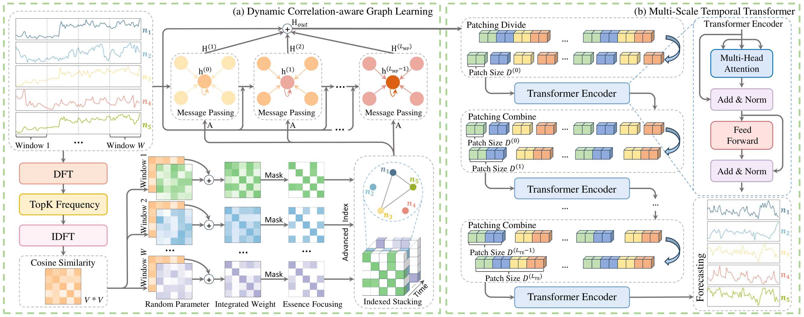

# DGraFormer

This is the code for paper:
> DGraFormer: Dynamic Graph Learning Guided Multi-Scale Transformer for Multivariate Time Series Forecasting

## Introduction

DGraFormer consists of two main components: Dynamic correlation-aware graph Learning (DCGL) and multi-scale temporal
transformer (MTT). The former aims to capture dynamic correlations across different time windows, filters out noise, and
selects key weights to guide the aggregation of relevant feature representations. The latter can effectively extract
temporal patterns from patch data at varying scales.

## Dependencies

Recent versions of the following packages for Python 3 are required:

* einops==0.8.0
* numpy==1.24.3
* matplotlib==3.7.5
* pandas==2.0.3
* scikit_learn==1.3.0
* torch==2.1.1

## Datasets

All of the datasets we use are publicly available datasets.

### Link

The used datasets are available at:

* ETT (4 subsets), Weather, Electricity, Solar-Energy and Traffic https://github.com/thuml/iTransformer
* Flight https://github.com/YoZhibo/MSGNet
* AirQualityUCI https://github.com/Gauhar1107/AirQualityUCI

## Usage

Use the following command to run the main script with configuration options. For example:

* python run.py